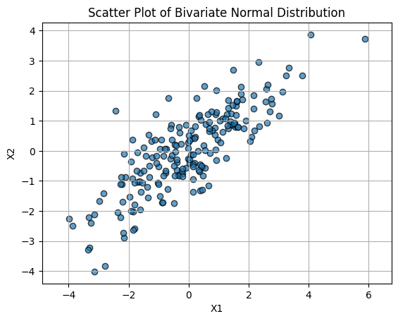
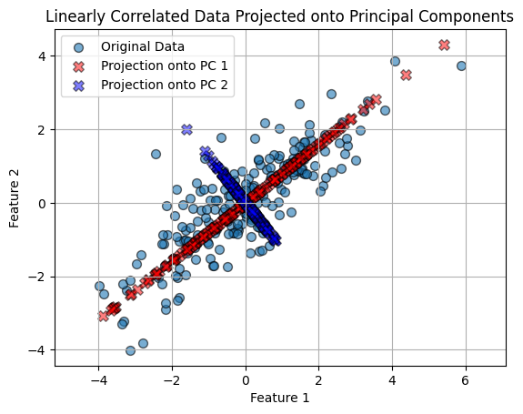
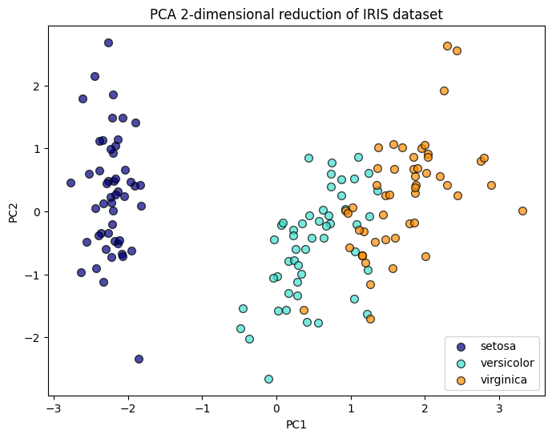
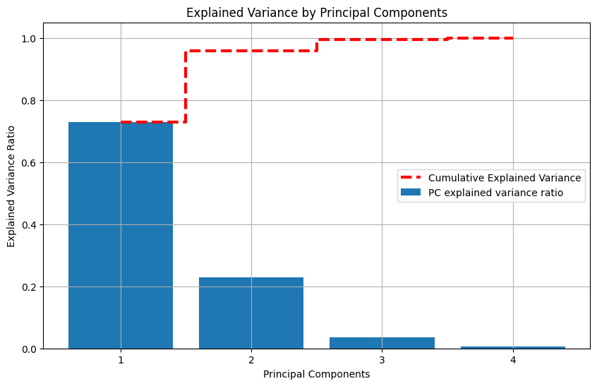

# Principal Component Analysis (PCA)

## Overview

This project demonstrates two core uses of Principal Component Analysis (PCA):

1. **Understanding principal directions in correlated 2D data**
2. **Reducing a higher-dimensional dataset to fewer dimensions while preserving most of the information**

The notebook contains two experiments:

- **Experiment 1:** Apply PCA to synthetic 2D correlated data and visualize the principal component directions and projections
- **Experiment 2:** Apply PCA to the 4-feature Iris dataset and reduce it to 2 dimensions for visualization and analysis

This project is useful for understanding both the **geometry** and the **practical purpose** of PCA.

---

## First PCA usage experiment: Projecting 2-D data onto its principal axes

This part of the notebook is focused on the geometric meaning of PCA.

## What PCA is

Principal Component Analysis (PCA) is an unsupervised learning technique used to transform data into a new coordinate system.

Instead of using the original features directly, PCA builds new features called **principal components**.

These principal components are:

- linear combinations of the original features
- orthogonal to each other
- ordered by how much variance they explain in the data

The first principal component captures the greatest possible variance.  
The second captures the next greatest variance subject to being orthogonal to the first.  
This continues until all components are formed.

If the original data has `p` features, then PCA can produce up to:

`min(number of samples, number of features)`

principal components.

The number of principal components is: min(number of samples, number of features) 
- the first principal component points in the direction where the data varies the most
- the second principal component is perpendicular to the first and captures the next largest variation and so on
- in PCA, each principal component is a linear combination of the original features  
 
Here with two featuers, we have PC1 = aX1 + bX2:
- where a and b are the weights
- those weights are what you see in pca.components_

---

## Why PCA is useful

PCA is commonly used for:

- **dimensionality reduction**
- **visualization of high-dimensional data**
- **noise reduction**
- **decorrelation of features**
- **feature extraction before downstream machine learning models**

In practice, PCA is especially useful when many features are correlated and the data effectively lies near a lower-dimensional subspace.

---

## Mathematical idea behind PCA

Suppose the data matrix is:

`X in R^(n x p)`

where:

- `n` = number of samples
- `p` = number of features

PCA finds directions `v_1, v_2, ..., v_p` such that the variance of the projected data is maximized one direction at a time.

For a principal component direction `v_k`, the projection of a data point `x` onto that direction is:

`z_k = x . v_k`

This scalar `z_k` is the coordinate of the point along the `k`-th principal component axis.

The corresponding projected point back in the original feature space is:

`z_k v_k`

So PCA does two things at once:

- gives a **new coordinate system**
- allows each point to be **approximated using fewer directions**

---

## Explained variance

Each principal component has an associated eigenvalue, usually denoted by:

`lambda_1, lambda_2, ..., lambda_p`

These values measure how much variance is captured by each component.

The explained variance ratio of component `k` is:

`explained_variance_ratio_k = lambda_k / (lambda_1 + lambda_2 + ... + lambda_p)`

This tells us what fraction of the total variance is captured by that component.

The cumulative explained variance for the first `m` components is:

`(lambda_1 + lambda_2 + ... + lambda_m) / (lambda_1 + lambda_2 + ... + lambda_p)`

This is what helps decide how many components to keep.

The explained variance ratio formula is: 
explained variance ratio of PC_k = lambda_k / (lambda_1 + lambda_2 + ... + lambda_p) where:  
- lambda_k = eigenvalue of the k-th principal component
- the denominator = total variance in the data
- p = number of principal components  
 
In regression:  
- explained variance = how much of the variation in the target variable y is explained by the model
- unexplained variance = residual error in predicting y
- This is tied to R^2, SSE, SSR, SST.
 
 
In PCA:
- explained variance = how much of the variation in the input data X is captured by each principal component
- there is no target y
- it is about representing the data well, not predicting an output. 
 
 
So:
- regression explained variance → variance explained in y
- PCA explained variance → variance captured in X

The explained variance can be seen as a ratio, so, here 0.91 percent of variance in the data is explained in the first component 

---

## PCA and reconstruction error

PCA can also be understood in error terms.

If we keep only the first `m` principal components, the information lost is tied to the variance of the discarded components:

`reconstruction_error = lambda_(m+1) + lambda_(m+2) + ... + lambda_p`

So keeping the components with the largest variance is equivalent to minimizing squared reconstruction error among all linear projections onto an `m`-dimensional subspace.

---

## Experiment 1: PCA on synthetic 2D correlated data

### Goal

The first experiment builds a 2D dataset from a bivariate normal distribution and uses PCA to identify the two principal directions of variation.

This part is mainly about **intuition and geometry**.

### Data generation

The notebook creates 200 samples from a multivariate normal distribution with:

- mean = `[0, 0]`
- covariance matrix:

`[[3, 2], [2, 2]]`

Because the off-diagonal values are nonzero, the two features are correlated.  
This creates an elongated cloud of points rather than a circular cloud.

### PCA model

The notebook fits:

`PCA(n_components=2)`

Since the dataset has 2 features, there are 2 principal components total. So the projection is happening, if dimensiones were higher, then we would have dimension reduction.

The returned component directions are approximately:

- `PC1 = [0.7822, 0.6231]`
- `PC2 = [-0.6231, 0.7822]`

These vectors define the new axes.

### Explained variance result

The notebook reports:

- `PC1 explained variance ratio = 0.9111946`
- `PC2 explained variance ratio = 0.0888054`

So:

- the first principal component explains about **91.12%**
- the second explains about **8.88%**

This means the data varies mostly along one dominant direction.

### Projection idea

For each point `x`, the notebook computes its projection score onto each principal component using dot products:

`projection_pc1 = x . PC1`  
`projection_pc2 = x . PC2`

Then it maps those scalar coordinates back onto the original feature plane:

`projected_point_on_PC1 = (x . PC1) PC1`  
`projected_point_on_PC2 = (x . PC2) PC2`

This is why the projected points lie exactly on the principal component lines.

The data varies in two main directions.  
The first direction, in red, is aligned in the direction having the widest variation 
The second direction, in blue, is perpendicular to first and has a lower variance. 
 
This is because when we project, we take each original point and drop it onto one PCA direction. 
So for a point (x1, x2):
- its projection onto PC1 = the closest point to (x1, x2) that lies on the PC1 line
- its projection onto PC2 = the closest point to (x1, x2) that lies on the PC2 line
 
 
So, PCA wants to express each point using the new axes PC1 and PC2 instead of the old axes X1 and X2.

### Interpretation

In this experiment:

- the red projected points show where each original point lands on the first principal direction
- the blue projected points show where each original point lands on the second principal direction

This illustrates that PCA is really rotating the coordinate system to align with the true spread of the data.

---

## Second PCA usage experiment: dimension reduction

The second part of the notebook moves from geometric intuition to practical compression of higher-dimensional data.

## Experiment 2: PCA for dimensionality reduction on the Iris dataset

### Goal

The second experiment applies PCA to the classic Iris dataset and reduces the feature space from 4 dimensions to 2 dimensions.

This part demonstrates PCA as a **dimensionality reduction tool**.

### Original dataset

The Iris dataset has:

- 150 samples
- 4 features
- 3 classes:
  - setosa
  - versicolor
  - virginica

Because the features are measured on different scales, the notebook standardizes them first.

### Standardization

The notebook uses:

`StandardScaler()`

This transforms each feature to have approximately:

- mean = 0
- standard deviation = 1

This step is important because PCA is variance-based.  
If features are on very different scales, larger-scale features can dominate the principal components unfairly.

### Reduction step

The notebook fits:

`PCA(n_components=2)`

on the standardized data.

This converts each original 4D sample into a 2D point:

`(score on PC1, score on PC2)`

So the dimensionality is reduced from:

`4 -> 2`

### Variance preserved

The notebook computes:

`100 * pca.explained_variance_ratio_.sum()`

and gets approximately:

`95.81%`

This means the first two principal components together preserve about **95.81%** of the total variance from the original 4-dimensional space.

That is a very strong result.  
It means the data can be compressed substantially while retaining most of its structure.

Most of the information is in the first 2 components. We could likely reduce from 4 features to 2 principal components and still keep about 96% of the variance

---

## Technical walkthrough of the code

### 1. Library imports

The notebook imports:

- `numpy`
- `matplotlib`
- `sklearn.decomposition.PCA`
- `sklearn.datasets`
- `sklearn.preprocessing.StandardScaler`

These support:

- numerical computation
- visualization
- PCA modeling
- built-in dataset loading
- feature scaling

### 2. Synthetic data creation

The first experiment uses `np.random.multivariate_normal(...)` to generate correlated 2D data.

This is a clean way to produce a dataset where PCA has an obvious geometric interpretation.

### 3. PCA fitting

The notebook uses:

`X_pca = pca.fit_transform(X)`

This both:

- learns the principal component directions from the data
- transforms the original data into the new PCA coordinate system

### 4. Accessing components

The principal directions are obtained through:

`pca.components_`

Each row of this matrix is one principal component direction.

### 5. Accessing explained variance

The explained variance ratios are obtained through:

`pca.explained_variance_ratio_`

This gives the fraction of variance captured by each component.

### 6. Projection calculations

The notebook explicitly computes projections using dot products:

`np.dot(X, components[0])`  
`np.dot(X, components[1])`

This is useful pedagogically because it shows what PCA coordinates really mean.

### 7. Standardization for Iris

Before PCA on Iris, the code applies:

`X_scaled = scaler.fit_transform(X)`

This is the correct preprocessing step for PCA in most real datasets.

### 8. Full explained variance plot

The notebook also runs:

`PCA()`  

without reducing the number of components, so all principal components are kept.

This allows the explained variance of all 4 components to be plotted and compared.

---

## Figures and analysis

### 1. `scatter-plot.png`

This figure shows the original synthetic 2D data.

The point cloud has a clear diagonal elongation, indicating that the two original features are correlated.  
This is exactly the kind of structure PCA is designed to detect.

Interpretation:

- the cloud is not spread equally in all directions
- one direction has much larger variance than the others
- therefore PCA should identify one dominant component

This plot visually motivates why the first principal component ends up explaining over 90% of the variance.

---

### 2. `correlated-projected-data.png`

This figure overlays:

- the original data points
- the projections onto PC1
- the projections onto PC2

This is one of the most important figures in the project because it makes the idea of projection concrete.

Interpretation:

- the **red points** lie along the first principal component line
- the **blue points** lie along the second principal component line
- the red line-like structure is much longer and more spread out than the blue one

That directly reflects the explained variance result:

- PC1 captures the dominant variation
- PC2 captures only a small residual variation

This figure also clarifies that a PCA projection is not a random transformation.  
It is the closest-point representation of the original data along a chosen principal direction.

---

### 3. `2D-reduction.png`

This figure shows the Iris dataset after reducing from 4 dimensions to 2 principal components.

Each point is displayed in the reduced PCA space, with color indicating class.

Interpretation:

- **setosa** appears well separated from the other two classes
- **versicolor** and **virginica** are partially separated, though some overlap remains
- the 2D PCA space preserves meaningful structure from the original 4D feature space

This demonstrates one of the most practical uses of PCA:  
it allows us to visualize high-dimensional data in 2D while retaining most of the important variation.

Because about 95.81% of the variance is preserved, this reduced visualization is informative rather than overly distorted.

---

### 4. `explained-variance.png`

This figure contains:

- blue bars for the explained variance ratio of each principal component
- a dashed red line for cumulative explained variance

Interpretation:

- PC1 contributes the largest share
- PC2 adds a substantial additional amount
- PC3 adds only a small amount
- PC4 contributes almost nothing

From the plot, the cumulative variance after the first two components is already around **96%**.

This is the key decision-making plot for dimensionality reduction.

It supports the conclusion that keeping only 2 components is justified because:

- most of the information is already retained
- the remaining components add little benefit
- the dimensionality can be cut in half from 4 to 2

---

## Main conclusions

This notebook demonstrates both the theory and the practice of PCA.

### From the synthetic 2D experiment

We learn that:

- PCA detects the dominant direction of variation
- principal components are new orthogonal axes
- projection onto a principal component means dropping a point onto that axis
- the first principal component can capture the vast majority of the variance when the data is strongly correlated

### From the Iris experiment

We learn that:

- PCA can compress a 4D dataset into 2D effectively
- standardization is important before applying PCA
- the first two components preserve about 95.81% of the variance
- PCA can make high-dimensional class structure visible in two dimensions

---

## When to use PCA in practice

PCA is especially useful when:

- the dataset has many numeric features
- features are correlated
- visualization is difficult due to high dimensionality
- you want to reduce noise or redundancy
- you want to preprocess data before another model

However, PCA also has limitations:

- principal components are linear combinations, so they may be harder to interpret than original features
- PCA is linear, so it may not capture nonlinear structure well
- PCA does not use labels, so it is not guaranteed to preserve class separation optimally for supervised tasks

---

## Files referenced in this repository

This README refers to the following generated figures:

- `scatter-plot.png`
- `correlated-projected-data.png`
- `2D-reduction.png`
- `explained-variance.png`

---

## Possible future improvements

Some natural extensions of this project would be:

- compare PCA with t-SNE or UMAP for visualization
- reconstruct data from reduced components and measure loss
- show scree plots more formally
- explore the effect of skipping standardization
- apply PCA before a classifier and compare performance

---

## Summary

This project gives a clear, visual introduction to PCA through two complementary examples:

- a geometric 2D example showing principal directions and projections
- a real 4D dataset example showing dimensionality reduction to 2D

Overall, the notebook shows that PCA is both:

- a mathematical method for finding the most informative directions in data
- a practical tool for compression, visualization, and structure discovery
